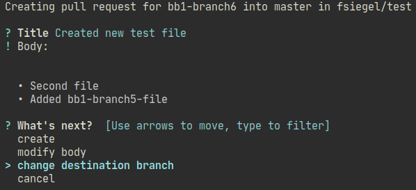
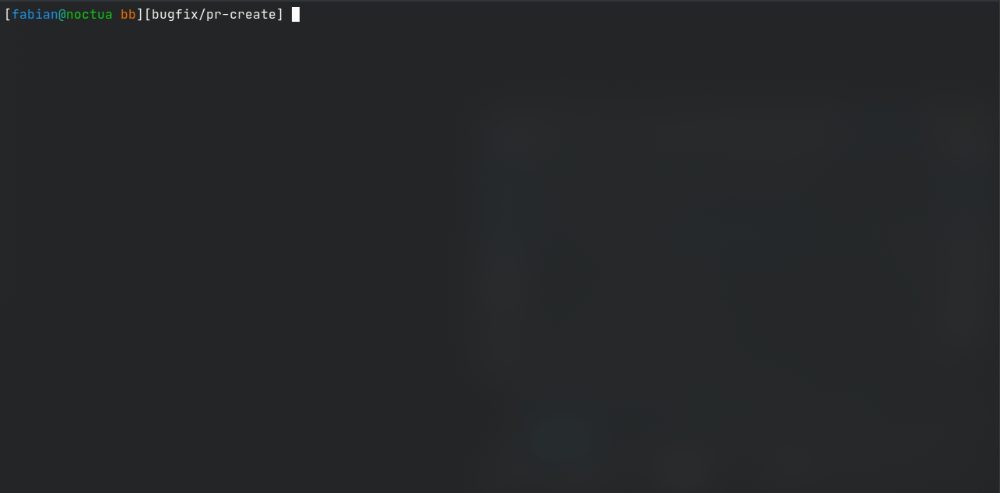
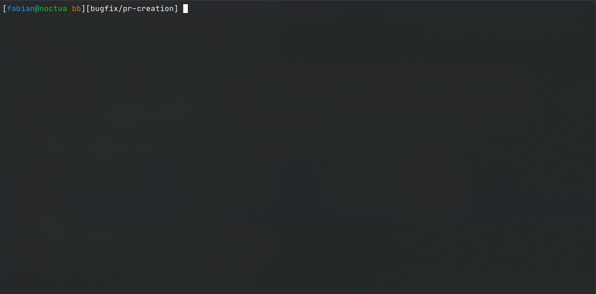
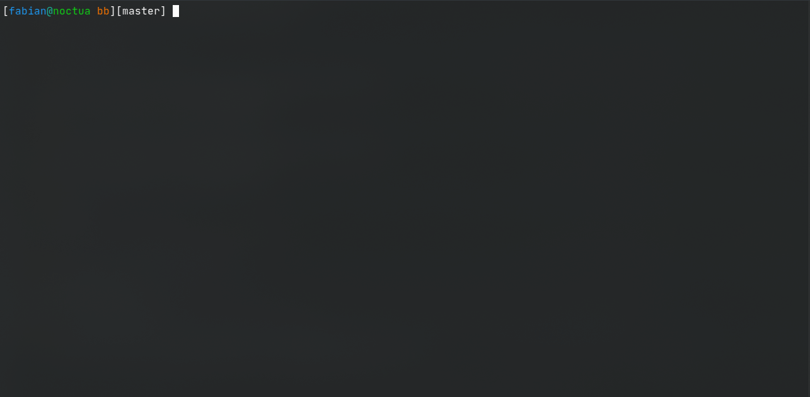

# bb

  [](https://goreportcard.com/report/github.com/craftamap/bb)


---

`bb` is an inoffical bitbucket.org command line tool deeply inspired by the 
official [GitHub CLI](https://github.com/cli/cli/). It brings pull requests, 
downloads, and other bitbucket concepts to your terminal.



## Installation

### General

Check out the [Releases](https://github.com/craftamap/bb/releases) page where you
can find the latest releases built for every environment. This includes
builds for macOS, Windows, Debian, and many more!

### Arch / AUR

```bash
yay bbcli-git
```

### Using `go get`
Make sure you have a working Go environment. Follow the 
[Go install instructions](https://golang.org/doc/install).

```bash
go get github.com/craftamap/bb
```

### Building from source
Make sure you have a working Go environment. Follow the 
[Go install instructions](https://golang.org/doc/install).

```bash
git clone https://github.com/craftamap/bb.git
go build
```

## Set-Up

You need to authenticate with your credentials first. You should generate a
[app password](https://support.atlassian.com/bitbucket-cloud/docs/app-passwords/)
for that. Make sure to grant read and write access to the features you want to use.
(**Recommended**:Repositories: Read/Write, Pull Requests: Read/Write, 
Pipelines: Read/Write, Account: Email/Read, Workspace membership: Read/Write)

Run the following command to enter your username and password:

```bash
bb auth login
```

Your credentials will be stored to `~/.config/bb/configuration.toml`.

## Usage

To see all available commands, use `bb` without any subcommand.
Many commands support the `--web`-flag to execute the action in the browser, or
open the browser after performing an specific action.

### Pull Requests

You can use `bb pr create` to create new pull requests.



Also, you can use `bb pr` to list (`bb pr list`), view (`bb pr view`) 
or merge  existing pull requests (`bb pr merge`) and see how their pipelines 
ran (`bb pr statuses`). Use `bb pr comments` to see the discussion of a pull 
request. Use `bb pr checkout` to checkout the branch of a pull request.



### Downloads

Manage downloads by listing (`bb downloads list`), downloading 
(`bb downloads <file name>`) or uploading (`br downloads upload`) them.




### Pipelines

Check the latest pipeline executions by running `bb pipelines list`. Find out
more about them by running `bb pipelines view <pipeline id>`, or view their
logs by running `bb pipelines logs <pipeline id>`.


### Repositories

View basic repository information by running `bb repo view`, or open the 
repository in the browser by using `bb repo view --web`.


## Development
### Used Libraries

We use the following bitbucket libary:

 - https://github.com/ktrysmt/go-bitbucket (Apache-2.0 License)
   
Thanks a lot for the work!
